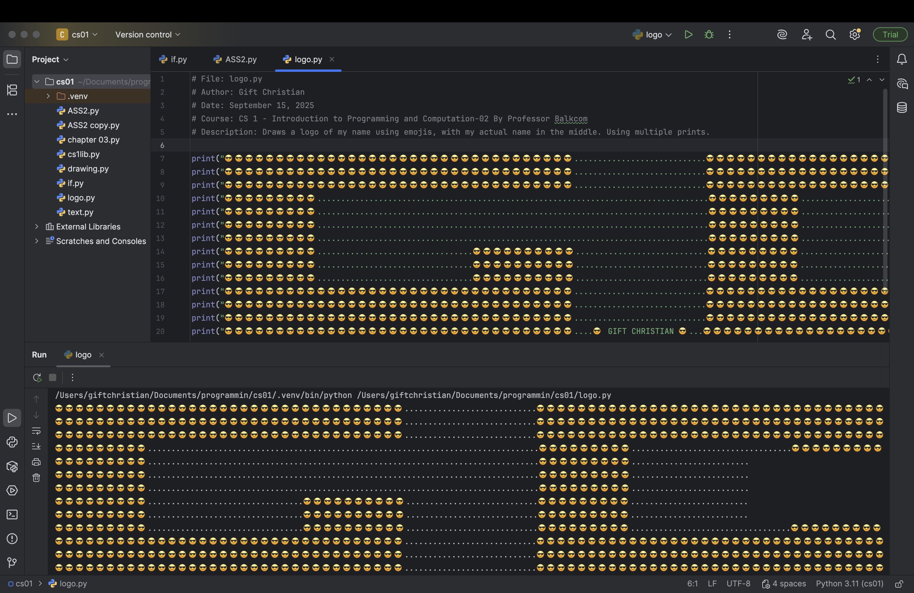
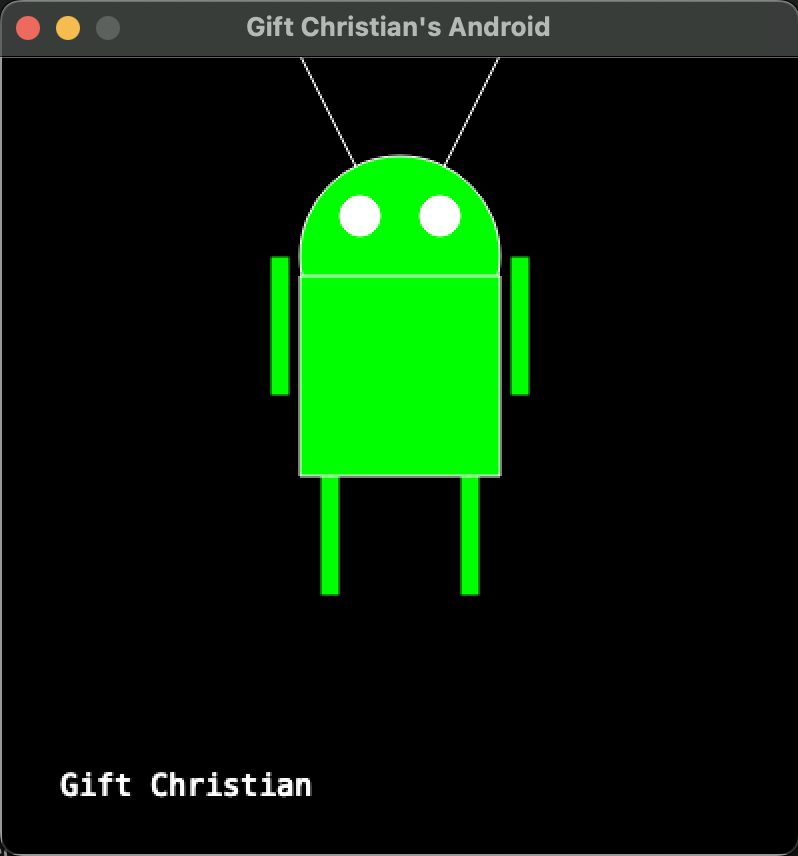
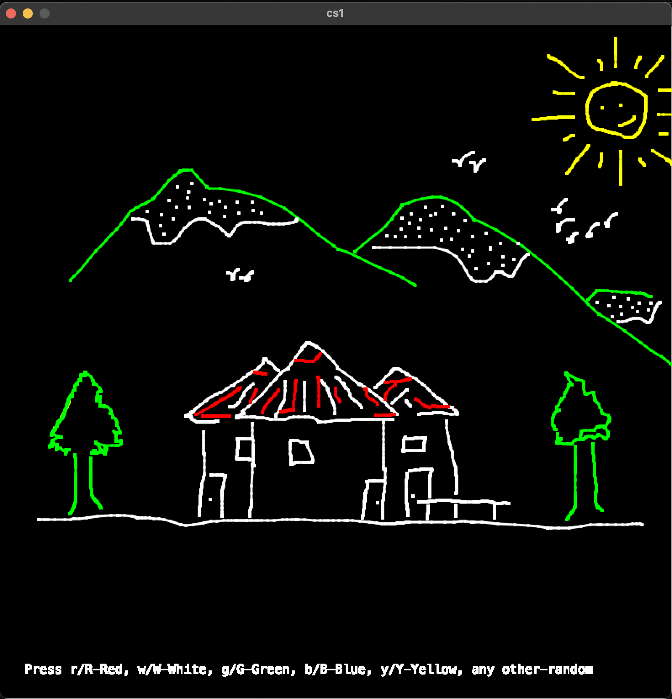
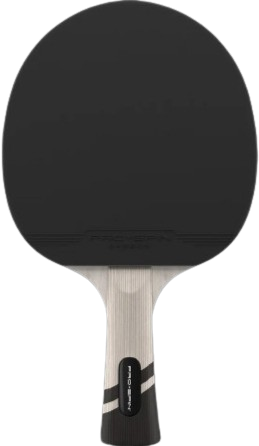
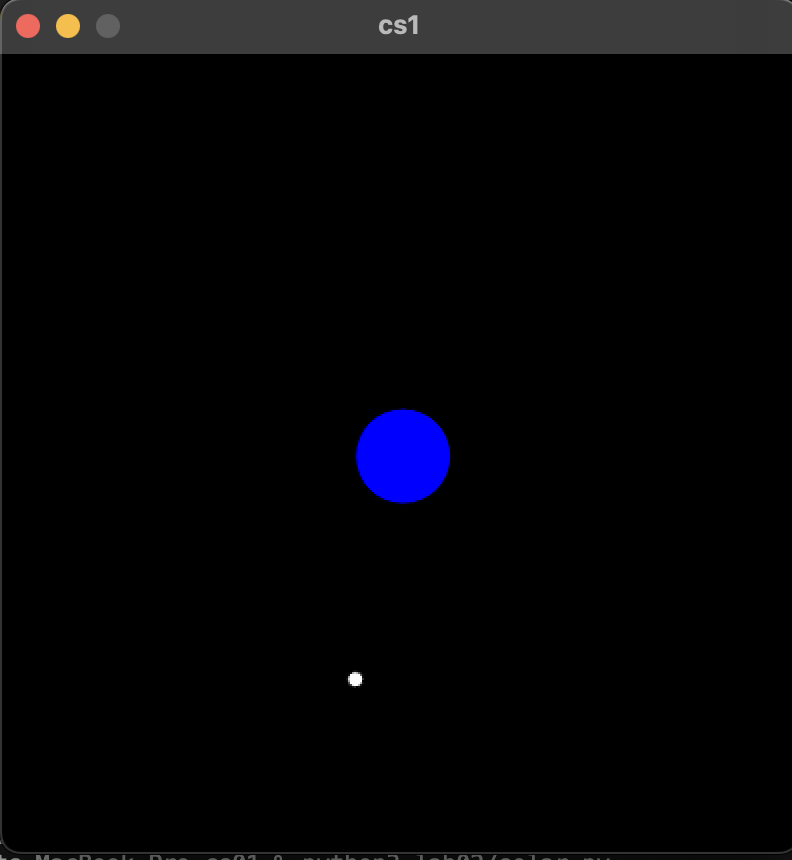
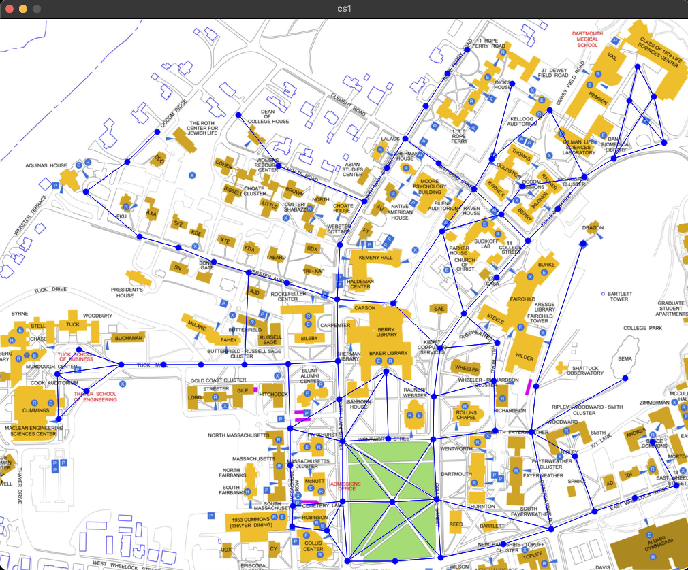

# 🎓 CS 1: Introduction to Programming and Computation

**Author:** Gift Christian  
**Course:** CS 1 - Introduction to Programming and Computation-02  
**Institution:** Dartmouth College  
**Professor:** Professor Balkcom  
**Term:** Fall 2025

---

## 📚 Overview

This repository contains a collection of programming projects, assignments, and labs completed during my CS 1 course at Dartmouth College. The projects demonstrate fundamental programming concepts including graphics programming, object-oriented design, algorithms, data structures, and interactive applications.

---

## 🛠️ Technologies & Skills

- **Language:** Python 3
- **Graphics Library:** cs1lib (Dartmouth's custom graphics library)
- **Concepts Covered:**
  - Graphics and animation
  - Object-oriented programming (classes, objects, inheritance)
  - Event-driven programming (keyboard/mouse input)
  - Algorithms (BFS, binary search)
  - Data structures (lists, dictionaries, graphs)
  - Physics simulation
  - Game development

---

## 📁 Project Structure

### 🔷 Short Assignments (SA)

| Assignment | Project Name | Description |
|------------|--------------|-------------|
| SA01 | [Emoji Logo](#sa01-emoji-logo) | ASCII art logo using emojis |
| SA02 | [Android Drawing](#sa02-android-drawing) | Graphics-based Android mascot drawing |
| SA03 | [Portia Simulation](#sa03-portia-simulation) | Wealth distribution simulation |
| SA04 | [String Art](#sa04-string-art) | Animated mathematical string art |
| SA05 | [Chalkboard](#sa05-chalkboard) | Interactive drawing application |
| SA06 | [N-Queens](#sa06-n-queens) | Chess N-Queens validation problem |
| SA07 | [Timer & Counter](#sa07-timer--counter) | OOP-based timer and counter classes |
| SA08 | [Card & Deck](#sa08-card--deck) | Playing card simulation |
| SA09 | [Binary Search](#sa09-binary-search) | Recursive binary search implementation |
| SA10 | [Interactive Story](#sa10-interactive-story) | Text-based adventure game with graph traversal |

### 🔶 Labs

| Lab | Project Name | Description |
|-----|--------------|-------------|
| Lab 01 | [Pong Game](#lab-01-pong-game) | Classic Pong arcade game implementation |
| Lab 02 | [Solar System](#lab-02-solar-system) | Physics-based solar system simulation |
| Lab 04 | [Campus Map Navigation](#lab-04-campus-map-navigation) | BFS pathfinding on Dartmouth campus map |

### 🔸 Recitations & Extras

| Type | Project Name | Description |
|------|--------------|-------------|
| Recitation 3 | [Face Drawing](#recitation-3-face-drawing) | OOP-based face with eye tracking |
| Exam | [Sprite Manipulation](#exam-sprite-manipulation) | 2D sprite transformation functions |

---

## 📋 Project Details

### SA01: Emoji Logo
**File:** `sa01/logo.py`  
**Date:** September 15, 2025

Creates a creative logo using emoji characters and print statements to display my name in a visually appealing ASCII art format.

**Skills:** Basic I/O, string formatting, creative output design



---

### SA02: Android Drawing
**File:** `sa02/drawing.py`  
**Date:** September 22, 2025

A graphics program that draws the Android mascot using cs1lib. The program demonstrates modular design with separate functions for each body part (head, eyes, arms, legs, antennas).

**Skills:** Graphics programming, functions, color manipulation, coordinate systems

**Features:**
- Modular function design
- Custom color palette (green Android theme)
- Layered drawing with proper z-ordering



---

### SA03: Portia Simulation
**File:** `sa03/portia.py`, `sa03/how_rich.py`  
**Date:** September 2025

A simulation exploring wealth distribution and probability.

**Skills:** Simulation, probability, data analysis

---

### SA04: String Art
**File:** `sa04/string_art.py`  
**Date:** October 2, 2025

An animated string art generator that creates mathematical patterns by connecting points around the window boundary, simulating physical thumbtack and string art.

**Skills:** Animation, loops, mathematical patterns, coordinate mapping

**Features:**
- Frame-by-frame animation at 7.5 FPS
- Dynamic point and line drawing
- Mathematical coordinate transformations


---

### SA05: Chalkboard
**File:** `sa05/chalkboard.py`  
**Date:** October 4, 2025

An interactive drawing application that allows users to draw on a digital canvas using mouse input, with keyboard controls for color selection.

**Skills:** Event handling, mouse/keyboard input, state management, UI design

**Features:**
- Mouse-based drawing with continuous strokes
- Color selection via keyboard (R=Red, G=Green, B=Blue, W=White, Y=Yellow)
- Random color generation for other keys
- Clear canvas functionality (C key)
- 800x800 canvas size

**Controls:**
| Key | Action |
|-----|--------|
| R | Red color |
| G | Green color |
| B | Blue color |
| W | White color |
| Y | Yellow color |
| C | Clear canvas |
| Other | Random color |



---

### SA06: N-Queens
**File:** `sa06/chess.py`  
**Date:** October 17, 2025 (Originally October 2023, updated 2024-2025)

An interactive N-Queens problem visualization and validation program. Users can place queens on a chessboard, and the program validates whether the placement is valid (no two queens attacking each other).

**Skills:** 2D arrays, algorithmic thinking, game logic, diagonal checking

**Features:**
- Interactive queen placement via mouse clicks
- Real-time validation checking
- Row, column, and diagonal conflict detection
- Visual feedback for invalid placements

**Validation Checkers:**
- Row checker: No two queens in same row
- Column checker: No two queens in same column
- Diagonal checkers: No two queens on same diagonal (forward and backslash)

---

### SA07: Timer & Counter
**Files:** `sa07/timer.py`, `sa07/counter.py`  
**Date:** October 20, 2025

Object-oriented implementation of a countdown timer using a modular counter system. Demonstrates class composition with Timer containing multiple Counter objects.

**Skills:** OOP, class composition, encapsulation

**Features:**
- Counter class with wrap-around functionality
- Timer class using hours/minutes/seconds counters
- Tick mechanism for countdown
- String representation in HH:MM:SS format

---

### SA08: Card & Deck
**Files:** `sa08/card.py`, `sa08/deck.py`  
**Date:** October 27, 2025

A playing card simulation implementing Card and Deck classes, demonstrating object-oriented programming principles.

**Skills:** OOP, enumeration-like patterns, string representation

**Features:**
- Card class with rank (1-13) and suit (1-4)
- Face card name conversion (Jack, Queen, King)
- Suit name mapping (clubs, spades, diamonds, hearts)
- Clean string representation ("Queen of hearts")

---

### SA09: Binary Search
**File:** `sa09/binary_search.py`  
**Date:** November 5, 2025

A recursive implementation of the binary search algorithm with an interactive driver program for testing.

**Skills:** Recursion, algorithm implementation, divide-and-conquer

**Features:**
- Recursive binary search implementation
- Default parameter handling
- Interactive testing interface
- Handles edge cases (empty list, element not found)

---

### SA10: Interactive Story
**Files:** `sa10/driver.py`, `sa10/vertex.py`, `sa10/story.txt`  
**Date:** November 15, 2025

A text-based adventure game engine using graph data structures. Players navigate through a story by making choices at each vertex (story node).

**Skills:** File I/O, graph data structures, text parsing, game loop design

**Features:**
- Vertex class representing story nodes
- Multi-line description support
- Choice-based navigation (a, b, c options)
- End detection for story completion

---

### Lab 01: Pong Game
**File:** `lab/lab01.py`  
**Date:** October 13, 2025

A complete implementation of the classic Pong arcade game with two-player controls, ball physics, and scoring.

**Skills:** Game development, physics simulation, collision detection, state management

**Features:**
- Two-paddle gameplay (left: A/Z, right: K/M)
- Ball physics with bouncing
- Paddle collision detection
- Game over state and reset functionality
- Press SPACE to start

**Controls:**
| Key | Action |
|-----|--------|
| A | Move left paddle up |
| Z | Move left paddle down |
| K | Move right paddle up |
| M | Move right paddle down |
| SPACE | Start game |
| Q | Quit |



---

### Lab 02: Solar System
**Files:** `lab02/solar.py`, `lab02/system.py`, `lab02/body.py`  
**Date:** October 31, 2025

A physics-based solar system simulation implementing gravitational interactions between celestial bodies using Newton's law of universal gravitation.

**Skills:** Physics simulation, OOP, numerical methods, vector math

**Features:**
- Gravitational constant implementation (G = 6.67430e-11)
- Multiple celestial bodies (Sun, Mercury, Venus, Earth, Mars)
- Real astronomical data for masses and orbital velocities
- Acceleration computation based on gravitational attraction
- Position and velocity updates using numerical integration

**Classes:**
- **Body:** Represents a celestial body with mass, position, velocity, and color
- **System:** Manages collection of bodies and computes gravitational interactions



---

### Lab 04: Campus Map Navigation
**Files:** `lab04/map_plot.py`, `lab04/bfs.py`, `lab04/load_graph.py`, `lab04/vertex.py`  
**Date:** November 18, 2025

An interactive Dartmouth campus map application that uses Breadth-First Search (BFS) to find shortest paths between locations.

**Skills:** Graph algorithms, BFS, file parsing, interactive UI, pathfinding

**Features:**
- Interactive map with clickable vertices
- BFS-based shortest path finding
- Visual path highlighting with gradient colors
- Hover highlighting for vertices
- Start/end point selection

**Usage:**
1. Click to select starting location (yellow)
2. Hover over destination to see path (gradient colors)
3. Path edges highlighted in green



---

### Recitation 3: Face Drawing
**Files:** `recitation3/face.py`, `recitation3/eye.py`, `recitation3/crowd.py`  
**Date:** Fall 2025

An OOP exercise creating a Face class with Eye subcomponents that can track mouse position.

**Skills:** OOP, class composition, coordinate geometry

**Features:**
- Face class with configurable position and size
- Eye class with look-at functionality
- Crowd class for managing multiple faces

---

### Exam: Sprite Manipulation
**File:** `exam/sprite.py`  
**Date:** Fall 2025

Functions for manipulating 2D sprite arrays including inversion, swapping, and horizontal flipping.

**Skills:** 2D array manipulation, in-place algorithms

**Functions:**
- `invert()`: Inverts sprite pixel values
- `swap()`: Swaps two positions in sprite
- `flip_horizontal()`: Mirrors sprite horizontally

---

## 🚀 Running the Projects

Most projects can be run using Python 3 with the cs1lib graphics library:

```bash
cd project_folder
python3 filename.py
```

**Prerequisites:**
- Python 3.x
- cs1lib (included in each project folder)

---

## 📧 Contact

**Gift C. Christian**  
Dartmouth College '29  
📧 gift.c.christian.29@dartmouth.edu

---

## 📜 License

This repository contains academic coursework. Please respect academic integrity policies if you are a current student.

---

*Last Updated: December 2025*
